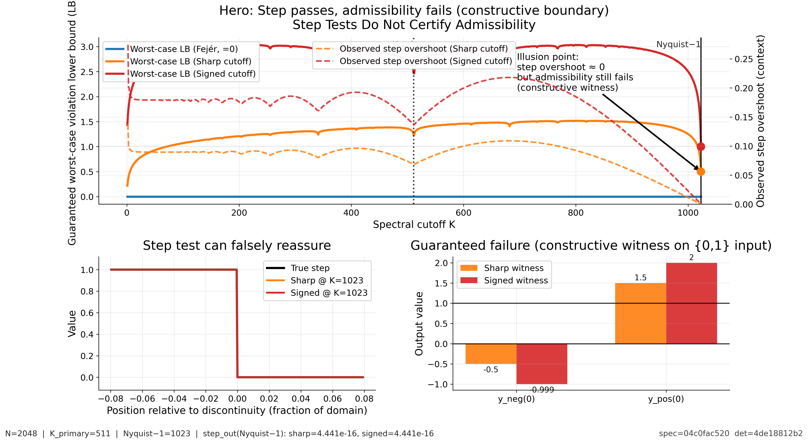

# Step Tests Do Not Certify Admissibility

**Claim demonstrated:** *Observed step tests do not certify admissibility.*  
A spectral operator can make a step look perfect (overshoot → 0) while still failing badly on other {0,1} inputs.

## Reproducibility
- spec_sha256: `04c0fac520fef120bb7f9b46156046a7962be1be471ed16dba30060d790f15df`
- determinism_sha256: `4de18812b2e06fe42a1acfa4c0e4b0c485b15738216185fc85dfb4cdf9dc362e`

## Key settings
- N = 2048
- K_primary = 511
- Nyquist−1 = 1023

## Key facts (constructive)
- **Fejér (Cesàro)** kernel is nonnegative ⇒ admissible on [0,1]^N.
- **Sharp** and **Signed** cutoffs have negative kernel coefficients for every K≥1 ⇒ non-admissible.
- At **Nyquist−1**, step overshoot ≈ 0 (looks perfect), but guaranteed worst-case violation stays bounded away from 0.

## Figures
### Fig 1 — Hero (illusion + constructive boundary)

### Fig 2 — Mechanism (kernel nonnegativity in real space)

### Fig 3 — Phase plot (observed overshoot vs guaranteed failure)

## Data for the paper
- `data/demo_data.json` contains the full K-sweep curves, key-point summaries, and hashes.
- `MANIFEST.json` contains sha256 hashes of every artifact.
